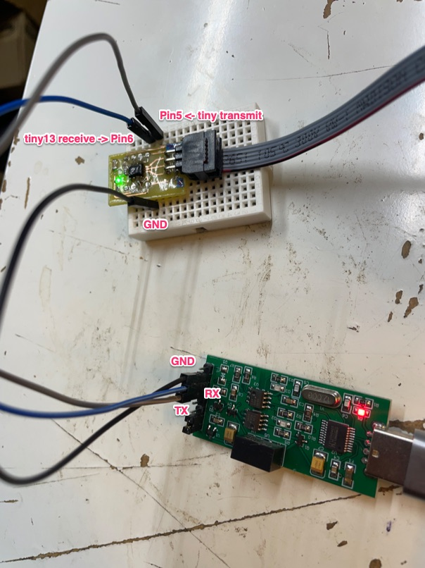

# Configure
This code needs `atmelavr@^4.2.0` which automatically pulls
```
 - framework-arduino-avr-microcore @ 2.3.0 
 - toolchain-atmelavr @ 1.70300.191015 (7.3.0)
```

The full `platfromio.ini` should look like this

```
[env:usbtiny]
board = attiny13a
board_build.f_cpu = 1200000L
platform = atmelavr
framework = arduino
upload_protocol = custom
monitor_speed = 19200
upload_speed = 9600

upload_flags =
    -C$PROJECT_PACKAGES_DIR/tool-avrdude/avrdude.conf
    -p$BOARD_MCU
    -cusbtiny
; Notice that avrdude is 7.2 below, not which comes with tool-avrdude 7.1
upload_command = /usr/local/bin/avrdude  $UPLOAD_FLAGS -U flash:w:$SOURCE:i
```

You can ignore this, but the previous working version of avrdude and atmelavr combimation looks like this. Notice explicit versions.


```
[env:usbtiny]
board = attiny13a
board_build.f_cpu = 1200000L
platform = atmelavr@^3.4.0
framework = arduino
upload_protocol = custom
upload_speed = 9600
upload_flags =
    -C$PROJECT_PACKAGES_DIR/tool-avrdude@1.60300.200527/avrdude.conf
    -p$BOARD_MCU
    -cusbtiny
    
upload_command = avrdude $UPLOAD_FLAGS -U flash:w:$SOURCE:i
platform_packages =
   tool-avrdude@^1.7.2
```

# Callibrate internal oscilator

Wire up as shown



upload the firmware in this project. Notice that averdude is hardcoded to be `/usr/local/bin/avrdude` it has to be 7.2+ otherwise you get `wrong signature`

Select the correct baud rate in the serial monitor - 19200 (for my attiny13). 

```
board_build.f_cpu = 1200000L
monitor_speed = 19200
```


Send the x character many times (x [send], x [send] ...). After a few tries, you should gradually see readable text in the serial monitor. After the calibration value has stabilized it's automatically stored in EEPROM address 0 for future use. This value is not loaded by default, but has to be loaded "manually" in your sketch like so:

```
  // Check if there exist any OSCCAL value in EEPROM addr. 0
  // If not, run the oscillator tuner sketch first
  uint8_t cal = EEPROM.read(0);
  if (cal < 0x80)
    OSCCAL = cal;
```

# Use

Once you have callibrated it, you don't need this code anymore. Use serial like this

```
#include <avr/io.h>
#include <util/delay.h>
#include <Arduino.h>
#include <EEPROM.h>


void setup()
{
    // Check if there exist any OSCCAL value in EEPROM addr. 0
    // If not, run the oscillator tuner sketch first
    uint8_t cal = EEPROM.read(0);
    if (cal < 0x80)
    {
        OSCCAL = cal;
    }
    Serial.begin();
}

void loop()
{
    Serial.print(F("current set "));
    Serial.print(currentSet);
    Serial.print('\n');

    delay(1000);
}
```

Notice that you don't need pin6 if you are not sending anything to the MCU. 